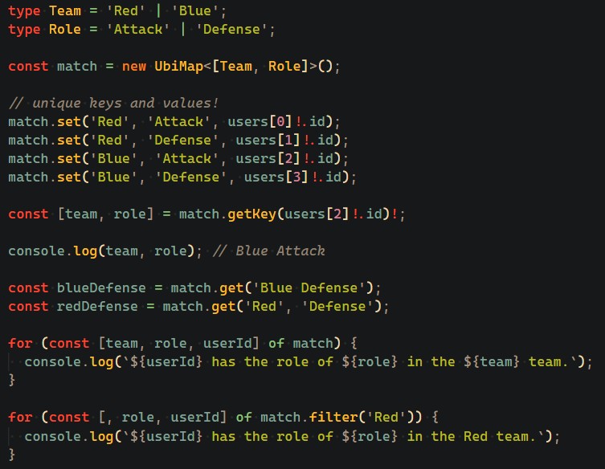

<br />

[](https://github.com/arthurfiorette/tinylibs/issues)
[](https://github.com/arthurfiorette/tinylibs/stargazers)
[](https://github.com/arthurfiorette/tinylibs/blob/main/LICENSE)
[](https://codecov.io/gh/arthurfiorette/tinylibs)
[](https://app.fossa.com/projects/git%2Bgithub.com%2Farthurfiorette%2Ftinylibs?ref=badge_shield)
[](https://gitter.im/tinylibs-js-org/community?utm_source=badge&utm_medium=badge&utm_campaign=pr-badge&utm_content=badge)
[](https://twitter.com/acdlite/status/974390255393505280)

[](https://www.npmjs.com/package/ubimap)
[](https://www.npmjs.com/package/ubimap)
[](https://www.jsdelivr.com/package/npm/ubimap)
[](https://bundlephobia.com/package/ubimap@latest)
[](https://packagephobia.com/result?p=ubimap@latest)

<br />

<div align="center">
  
</div>

<h3 align="center">
  <code>Ubimap</code> is a safe, typed, enumerable bidirectional map that ensures unique values and supports compound keys.
  <br />
  <br />
</h3>

<br />

## Table of Contents

- [Table of Contents](#table-of-contents)
- [Installing](#installing)
  - [Node](#node)
  - [Browser](#browser)
  - [Url Import](#url-import)
- [Getting Started with `UbiMap`](#getting-started-with-ubimap)
- [Basic Usage](#basic-usage)
  - [1. Importing `UbiMap`](#1-importing-ubimap)
  - [2. Creating an Instance](#2-creating-an-instance)
  - [3. Setting Key-Value Pairs](#3-setting-key-value-pairs)
  - [4. Getting Values by Key](#4-getting-values-by-key)
  - [5. Getting Keys by Value](#5-getting-keys-by-value)
  - [6. Listing Keys or Values with Prefixes](#6-listing-keys-or-values-with-prefixes)
  - [7. Iterating Over Entries](#7-iterating-over-entries)
- [Example](#example)
- [Error Handling](#error-handling)
- [License](#license)

<br />

## Installing

### Node

```sh
npm install ubimap # or yarn add ubimap
```

```js
const { UbiMap } = require('ubimap');
import { UbiMap } from 'ubimap';
```

### Browser

```html
<script
  crossorigin
  src="https://cdn.jsdelivr.net/npm/ubimap@latest/dist/index.umd.js"
></script>
```

```js
const { UbiMap } = window.ubimap;
```

### Url Import

```ts
import { UbiMap } from 'https://cdn.skypack.dev/ubimap@latest';
```

<br />

## Getting Started with `UbiMap`

`UbiMap` is a safe, bidirectional map that allows you to store and retrieve values based
on compound keys. It ensures that both keys and values are unique and provides methods to
query the map in both directions. This guide will walk you through how to set up and use
`UbiMap`.

<br />

## Basic Usage

### 1. Importing `UbiMap`

First, import the `UbiMap` class into your TypeScript file:

```ts
import { UbiMap } from 'ubimap';
```

### 2. Creating an Instance

To create an instance of `UbiMap`, simply pass the key structure as a tuple type, and
optionally, the value type and separator:

```ts
const ubimap = new UbiMap<[string, string]>();
```

- `K` is the tuple representing the compound key.
- `V` is the type of the values (default is `string`).
- `S` is the separator used to join the key components (default is `' '`).

### 3. Setting Key-Value Pairs

You can set key-value pairs using the `set` method:

```ts
ubimap.set('a', 'b', 'value1'); // Key: 'a b', Value: 'value1'
ubimap.set('c', 'd', 'value2'); // Key: 'c d', Value: 'value2'
```

Both keys and values must be unique. If you try to add a duplicate key or value, an error
will be thrown:

```ts
ubimap.set('a', 'b', 'value1'); // This will throw an error if 'a b' already exists.
```

### 4. Getting Values by Key

You can retrieve values by using the `get` method, providing the components of the key as
separate arguments:

```ts
const value = ubimap.get('a', 'b'); // Returns 'value1'
```

### 5. Getting Keys by Value

If you want to find the key associated with a value, you can use the `getKey` method:

```ts
const key = ubimap.getKey('value1'); // Returns 'a b'
```

### 6. Listing Keys or Values with Prefixes

You can list keys or values that match a given prefix using `keys` and `values`:

```ts
// List keys with a prefix 'a'
const keysWithPrefix = ubimap.keys('a'); // ['a b']

// List values with a prefix 'value'
const valuesWithPrefix = ubimap.values('value'); // ['value1', 'value2']
```

### 7. Iterating Over Entries

You can also iterate over all key-value pairs using a `for...of` loop:

```ts
for (const [firstKey, secondKey, value] of ubimap) {
  console.log(firstKey, secondKey, value);
}
```

This will log each key-value pair in the map.

<br />

## Example

```ts
import { UbiMap } from 'ubimap';

// Create a new UbiMap with compound keys and string values
const ubimap = new UbiMap<[string, string]>();

// Add some key-value pairs
ubimap.set('a', 'b', 'value1');
ubimap.set('c', 'd', 'value2');

// Retrieve a value by key
const value = ubimap.get('a', 'b'); // 'value1'

// Retrieve the key for a value
const key = ubimap.getKey('value2'); // 'c d'

// List all keys with the prefix 'a'
const keysWithPrefix = ubimap.keys('a'); // ['a b']

// Iterate through all entries
for (const [key, value] of ubimap) {
  console.log(key, value);
}
```

<br />

## Error Handling

If you try to add a duplicate key or value, an error can be thrown. For example:

```ts
try {
  ubimap.set('a', 'b', 'value1');
  ubimap.set('a', 'b', 'value2');
} catch (error) {
  if (error instanceof KeyAlreadyExistsError) {
    console.error(error.message);
  }

  if (error instanceof ValueAlreadyExistsError) {
    console.error(error.message);
  }
}
```

<br />

## License

Licensed under the **MIT**. See [`LICENSE`](LICENSE) for more informations.

[](https://app.fossa.com/projects/git%2Bgithub.com%2Farthurfiorette%2Ftinylibs?ref=badge_small)

<br />
